<div align="center">
  
</div>

# Pocket Utility

<div align="center">
  <a href="https://github.com/kiran-embedded/pocket-utility/releases/latest">
    
  </a>
  
  
</div>

Hey everyone! I got tired of downloading a separate app every time I needed to scan a QR code, check my compass, format some JSON, or flip a coin. It felt like my phone was just a chaotic drawer of random single-purpose tools, half of which wanted weird permissions.

> **📥 Want to just use the app?**  
> [**Download the latest APK here**](https://github.com/kiran-embedded/pocket-utility/releases/latest/download/app-release.apk) and install it directly on your Android device!

So, I built **Pocket Utility**—an all-in-one Flutter app that packs over 40 everyday tools and developer utilities into a single, clean interface. I focused heavily on making it fast, privacy-respecting (no sketchy trackers just to use a flashlight), and fully offline where possible.

---

## 🚧 Beta Features (Work in Progress)

I'm actively tuning the sensor integrations. The following features are currently in **Beta** because they rely heavily on device-specific hardware calibration:
- **Compass:** Works, but might require phone calibration (that weird figure-8 motion) on some devices.
- **Altitude/Altimeter:** Still smoothing out the GPS vs Barometer data blending for accurate elevation.
- **Sound Meter (Decibel):** Hardware microphones differ wildly from phone to phone, so the dB readings are relative right now, not absolute.

Feel free to open an issue if you notice weird readings on your specific phone model!

---

## 🛠️ What's Inside?

I categorized the tools to keep the dashboard organized. Here's exactly what's baked in right now:

### Hardware & Sensors
- **Flashlight & Screen Light:** No ads, just light.
- **GPS & Altitude (Beta):** Raw location data viewer.
- **Compass (Beta):** Magnetic heading and orientation.
- **Sound Meter (Beta):** Decibel tracking.
- **Speedometer:** Uses GPS to track your speed.
- **Pedometer:** Simple step counter.
- **Level & Protractor:** For quick physical measurements.
- **QR / Barcode Scanner:** Instant scanning and parsing.

### Developer Utilities
- **JSON Formatter:** Paste ugly JSON, get pretty JSON.
- **Base64 Encoder/Decoder:** Quick conversions.
- **Hash Generator:** MD5, SHA-1, SHA-256 right on your phone.
- **URL Encoder/Decoder:** Handle web strings quickly.
- **Color Picker & Palette:** Grab hex codes or explore palettes.
- **ASCII, Binary, and Hex Converters:** Quick data translation.
- **UUID Generator:** Need an ID? Boom.
- **Lorem Ipsum Generator:** For mocking up text layouts.
- **Markdown Preview:** Draft and preview markdown on the go.

### Daily Calculators & Converters
- **Standard Calculator:** The basics.
- **Currency Converter:** Real-time exchange rates (needs connection to update).
- **Unit Converter:** Length, weight, volume, etc.
- **BMI Calculator:** Quick health check.
- **Discount & Tip Calculators:** For shopping and dining out.
- **Age Calculator:** Exact age down to the days.
- **Loan Calculator:** Quick mortgage/loan estimates.
- **Unit Price Calculator:** Find out which grocery item is actually cheaper per ounce.

### Time & Productivity
- **Pomodoro Timer:** Stay focused with standard work/break intervals.
- **World Clock:** Track different timezones.
- **Stopwatch & Timer:** Simple, precise time tracking.
- **Alarm:** Basic local alarms.

### Text & Randomizers
- **Clipboard Manager:** Save snippets you use often.
- **Word Counter & Whitespace Remover:** Quick text scrubbing.
- **Text Repeater:** Repeat strings easily.
- **Text-to-Speech (TTS):** Type it, hear it out loud.
- **Morse Code:** Translate text to morse and vice versa.
- **Password Generator:** Secure, customizable passwords.
- **Dice Roller & Coin Flipper:** Resolve arguments quickly.
- **Random Picker:** Input a list, let the app choose.

---

## 📂 Code Structure

I tried to keep the codebase modular so it doesn't turn into a spaghetti monster. I'm using a feature-first approach. If you want to add a tool, you basically just drop it in the `features/tools` folder.

```text
lib/
├── core/
│   ├── providers/          # Global state (theme, currency, etc.)
│   ├── theme/              # Colors, fonts, and dark mode logic
│   └── utils/              # Shared helper functions
├── features/
│   ├── dashboard/          # The main grid UI you see on launch
│   ├── device_info/        # App settings and device hardware stats
│   ├── emergency/          # Quick emergency shortcuts
│   ├── onboarding/         # First-time permissions request
│   ├── splash/             # Startup screen
│   └── tools/              # Where the magic happens (each tool has its own folder)
│       ├── age_calculator/
│       ├── compass/        # (Beta code lives here)
│       ├── qrcode_scanner/
│       └── ... (and 40 more)
└── main.dart               # The entry point
```

---

## 🚀 Running it Locally

If you want to poke around or build it yourself:

1. You'll need the Flutter SDK (I'm using `^3.10.4` or newer).
2. Clone this repo:
   ```bash
   git clone https://github.com/kiran-embedded/pocket-utility.git
   ```
3. Hop into the folder:
   ```bash
   cd pocket-utility
   ```
4. Grab the packages:
   ```bash
   flutter pub get
   ```
5. Run it on your emulator or plugged-in phone:
   ```bash
   flutter run
   ```

## 🤝 Contributing

Honestly, if you want to build a new tool and add it to the pile, I'd love that! Just follow the existing structure in `features/tools`, keep the UI consistent with the theme controller, and submit a PR. 

If you find a bug (especially with the beta hardware sensors), please drop an issue so we can track it down.

License is MIT. Have fun!
